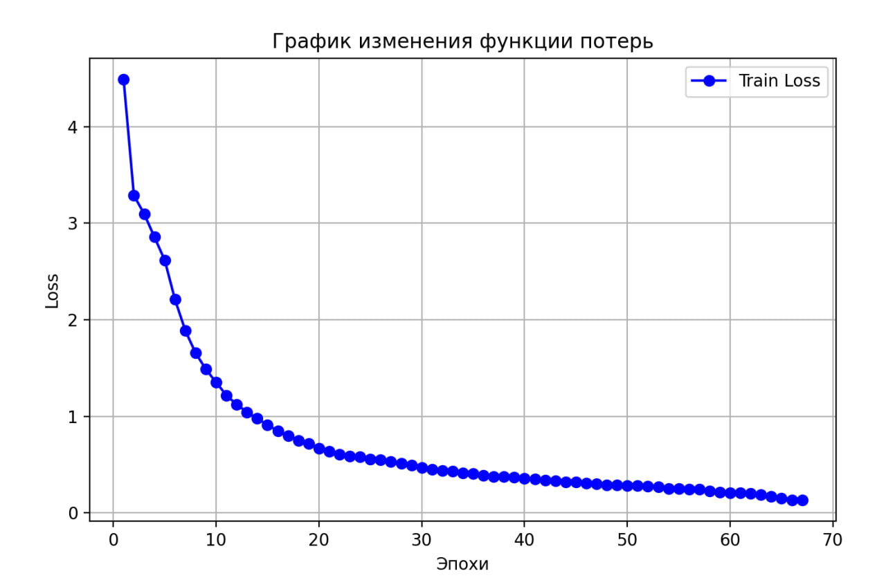

# XakSpring2025

.env 

    #остальные настройки
    SECRET_KEY="YOUR_SEACKRET_KEY"
    DEBUG=True # на время разработки true на прод false

    # база данных
    DATABASE_NAME="YOUR_DATABASE_NAME"
    DATABASE_USER="YOUR_DATABASE_USER"
    DATABASE_PASSWORD="YOUR_DATABASE_PASSWORD"
    DATABASE_HOST=localhost # пока что не трогать для докера не нужно будет это менять 
    DATABASE_PORT=5432
# [Модель](https://huggingface.co/RimasZzz/agriculture_text_transform_model)
## [Архитектура](model/agriculture_text_transform_model/config.json)

  

## [Обучение](model/train.py)

  

## [Примеры работы](model/test.py)
Source: `Пахота зяби под мн тр` 
Result: `Пахота зяби под Многолетние травы`

Source: `Предп культ под оз пш` 
Result: `Предпосевная культивация под Пшеница озимая`

Source: `2-е диск сах св под пш` 
Result: `2-е Дискование Свекла сахарная под Пшеница озимая`

Source: `Внесение мин удобрений под оз пшеницу` 
Result: `Внесение минеральных удобрений под Пшеница озимая`

Source: `Прикат мн тр под оз пш` 
Result: `Прикатывание посевов Многолетние травы под Пшеница озимая`
