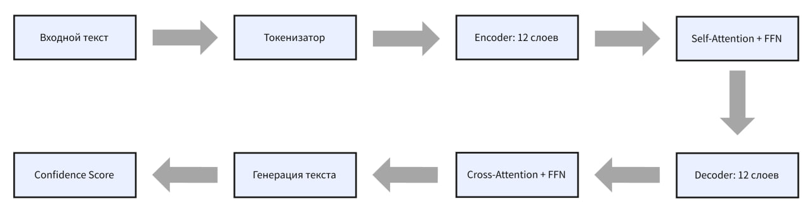
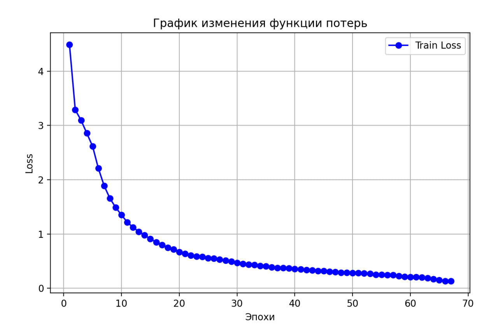
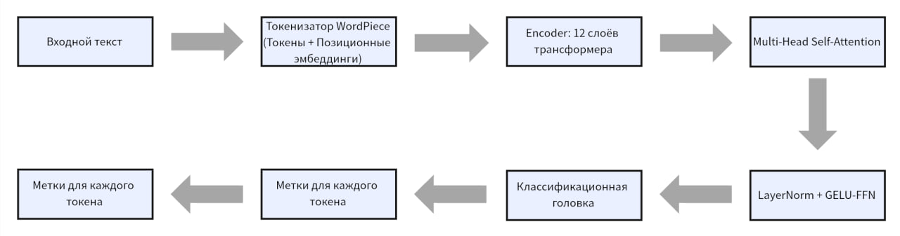
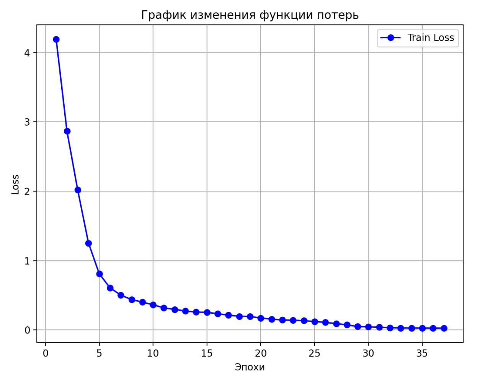
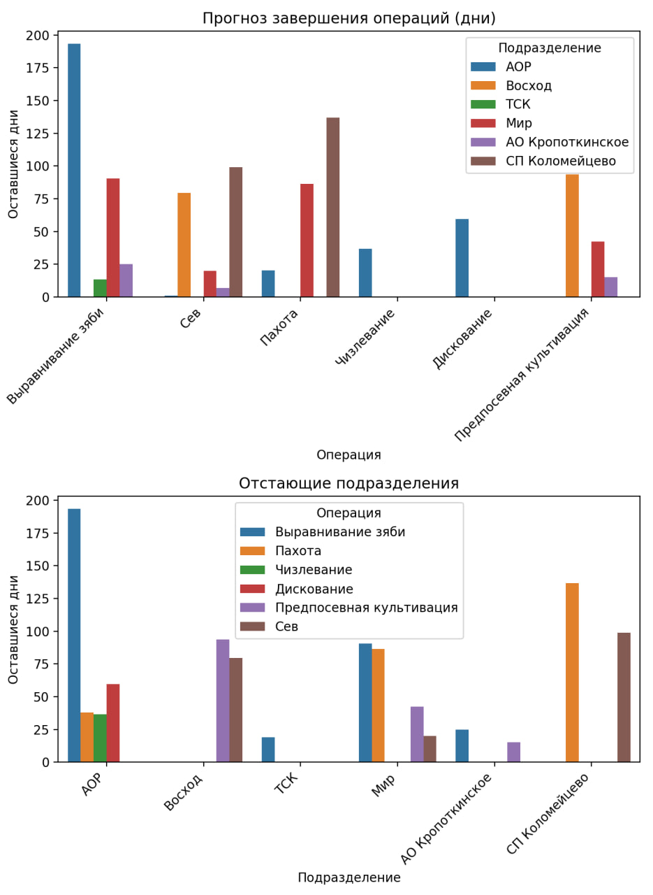
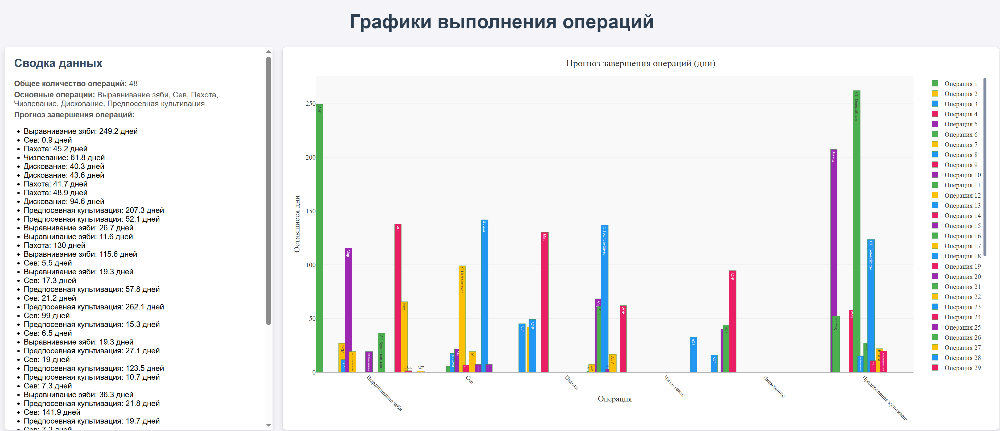
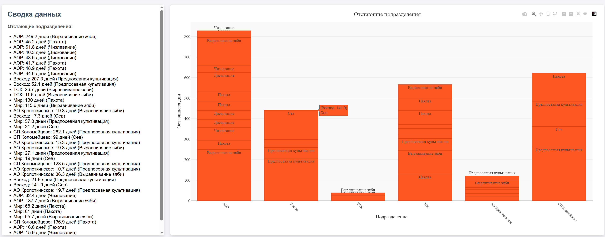
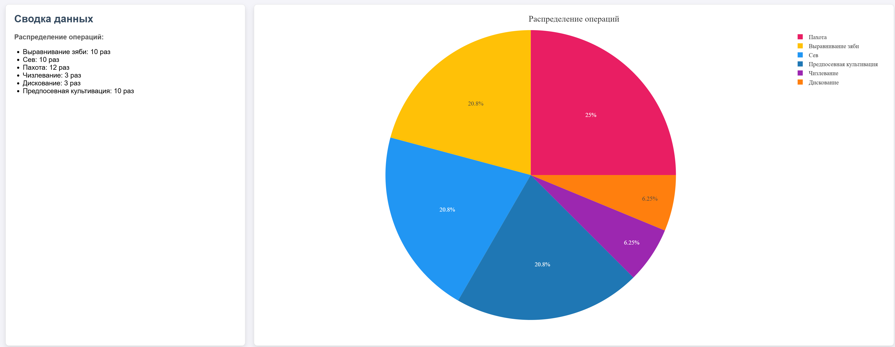

# XakSpring2025

Файл с локальными .env 
```
  #остальные настройки
  SECRET_KEY="YOUR_SEACKRET_KEY"
  DEBUG=True # на время разработки true на прод false

  # база данных
  DATABASE_NAME="YOUR_DATABASE_NAME"
  DATABASE_USER="YOUR_DATABASE_USER"
  DATABASE_PASSWORD="YOUR_DATABASE_PASSWORD"
  DATABASE_HOST=localhost
  DATABASE_PORT=5432
```

# [T5 Модель](https://huggingface.co/RimasZzz/agriculture_text_transform_model)
## [Архитектура](model/agriculture_text_transform_model/config.json)
<p align="center">
  
</p>

## [Обучение](model/train.py)
<p align="center">
  
</p>

## [Примеры работы](model/test.py)
Source: `Пахота зяби под мн тр`<br>
Result: `Пахота зяби под Многолетние травы`

Source: `Предп культ под оз пш`<br>
Result: `Предпосевная культивация под Пшеница озимая`

Source: `2-е диск сах св под пш`<br>
Result: `2-е Дискование Свекла сахарная под Пшеница озимая`

Source: `Внесение мин удобрений под оз пшеницу`<br>
Result: `Внесение минеральных удобрений под Пшеница озимая`

Source: `Прикат мн тр под оз пш`<br>
Result: `Прикатывание посевов Многолетние травы под Пшеница озимая`

# [ner Модель]()
## [Архитектура]()
<p align="center">
  
</p>

## [Обучение]()
<p align="center">
  
</p>

## [Примеры работы]()
Source: <br>
```Дискование 2-е под Ячмень озимый По ПУ 61/352 Отд 11 32/32 Отд 12 29/219```<br>
Result:
```
- OPERATION: 'Дискование 2-е'
- CROP: 'Ячмень озимый'
- SUBUNIT: 'По ПУ 61/352'
- DEPARTMENT: 'Отд 11'
- DEPARTMENT: 'Отд 12'
```

Source: <br>
```16.11 Мир Пахота под Кукуруза товарная 30 га, 599 га, 89%, 73 га остаток. Пахота под Соя товарная 30 га, 879 га, 77%, 260 га остаток. Работало 2 агрегата.```<br>
Result:
```
- DATE: '16.11'
- DEPARTMENT: 'Мир'
- OPERATION: 'Пахота'
- CROP: 'Кукуруза товарная'
- HECTARE: '30 га'
- HECTARE: '599 га'
- OPERATION: 'Пахота'
- CROP: 'Соя товарная'
- HECTARE: '30 га'
- HECTARE: '260 га'
```

Source: <br>
```Пахота под Соя товарная: День - 295 га От начала - 6804 га (79%) Остаток- 1774 га```<br>
Result:
```
- OPERATION: 'Пахота'
- CROP: 'Соя товарная:'
- HECTARE: '295 га'
- HECTARE: '6804 га'
- HECTARE: '1774 га'
```

# Модуль статистики
## Первое приближенеие
<p align="center">
  
</p>

## Прогноз завершения операций

Оценка времени завершения сельскохозяйственных операций (посев, уборка, внесение удобрений и т.д.) на основе данных.

<p align="center">
  
</p>

Далее, анализ с помощью временных рядов для прогнозирования сроков выполнения работ (на будущее)

## Отстающие подразделения

Выявление пу, которые работают менее эффективно, чем другие.

<p align="center">
  
</p>

Сравнительный анализ производительности по различным метрикам

<p align="center">
  
</p>

## Сводка данных
Агрегация данных из различных источников для предоставления общей картины состояния сельского хозяйства(на данный момент только кол-во операций по пу)

## Прогнозирование урожайности (на будущее)
Оценка будущей урожайности на основе исторических данных, погодных условий, типа почвы и агротехнических мероприятий
Использование регрессионных моделей для прогнозирования урожайности

## Оптимизация использования ресурсов (на будущее)
Корреляционный анализ для выявления связей между затратами и результатами
Анализ временных рядов для определения оптимальных сроков внесения удобрений и полива

